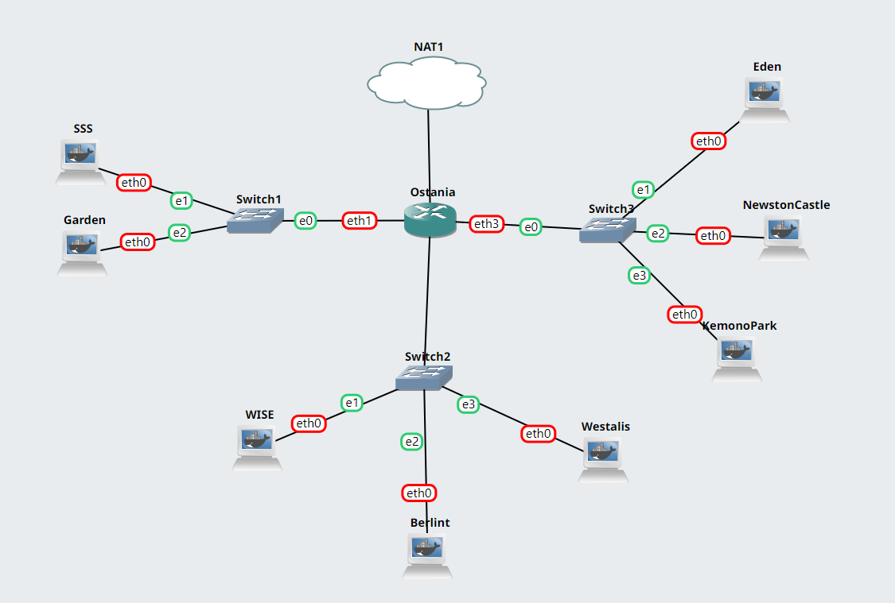

# Jarkom-Modul-3-C06-2022

## Anggota Kelompok
5025201050 - Elshe Erviana Angely
5025201051 - Muhammad Fath Mushaffa Azhar
5025201076 - Raul Ilma Rajasa

## Topologi
Membuat topologi dengan **WISE** sebagai DNS Server, **Westalis** sebagai DHCP Server, **Berlint** sebagai Proxy Server, dan **Ostania** sebagai DHCP Relay. </br >
Topologinya adalah sebagai berikut:

Untuk mengaturnya, dilakukan konfigurasi sebagai berikut:
- Ostania
    ```
    auto eth0
    iface eth0 inet dhcp

    auto eth1
    iface eth1 inet static
    address 192.182.1.1
    netmask 255.255.255.0

    auto eth2
    iface eth2 inet static
    address 192.182.2.1
    netmask 255.255.255.0

    auto eth3
    iface eth3 inet static
    address 192.182.3.1
    netmask 255.255.255.0
    ```
- WISE
    ```
    auto eth0
    iface eth0 inet static
    address 192.182.2.2
    netmask 255.255.255.0
    gateway 192.182.2.1
    ```
- Berlint
    ```
    auto eth0
    iface eth0 inet static
    address 192.182.2.3
    netmask 255.255.255.0
    gateway 192.182.2.1
    ```
- Westalis
    ```
    auto eth0
    iface eth0 inet static
    address 192.182.2.4
    netmask 255.255.255.0
    gateway 192.182.2.1
    ```
- SSS
    ```
    auto eth0
    iface eth0 inet dhcp
    ```
- Garden
    ```
    auto eth0
    iface eth0 inet dhcp
    ```
- Eden
    ```
    auto eth0
    iface eth0 inet dhcp
    hwaddress ether d6:10:58:ba:a6:a4
    ```
- NewstonCastle
    ```
    auto eth0
    iface eth0 inet dhcp
    hwaddress ether d6:10:58:ba:a6:a4
    ```
- KemonoPark
    ```
    auto eth0
    iface eth0 inet dhcp
    ```
Selanjutnya, untuk memastikan setiap node terhubung internet, maka digunakan command:
```sh
iptables -t nat -A POSTROUTING -o eth0 -j MASQUERADE -s 192.182.0.0/16
apt-get update
```
## Soal 1
Loid bersama Franky berencana membuat peta tersebut dengan kriteria **WISE** sebagai **DNS Server**, **Westalis** sebagai **DHCP Server**, **Berlint** sebagai **Proxy Server**. Maka, dilakukan konfigurasi sebagai berikut:
- WISE (DNS Server)
    ```sh
    echo 'nameserver 192.168.122.1' > '/etc/resolv.conf'
    apt-get update &
    wait
    apt-get install bind9 -y &
    wait
    service bind9 start
    ```
- Westalis (DHCP Server)
    ```sh
    echo 'nameserver 192.168.122.1' > '/etc/resolv.conf'
    apt-get update
    apt-get install isc-dhcp-server -y
    echo 'INTERFACES=\"eth0\"' > '/etc/default/isc-dhcp-server'
    service isc-dhcp-server start
    ```
- Berlint (Proxy Server)
    ```sh
    echo 'nameserver 192.168.122.1' > '/etc/resolv.conf'
    apt-get update
    apt-get install squid -y
    service squid start
    ````

## Soal 2
Ostania akan dibuat menjadi DHCP Relay. Setup yang dilakukan adalah sebagai berikut:
```sh
apt-get update
apt-get install isc-dhcp-relay -y
service isc-dhcp-relay start
```
Kemudian dilakukan konfigurasi pada `/etc/default/isc-dhcp-relay`
```sh
SERVERS="192.182.2.4" # IP Westalis
INTERFACES="eth1 eth2 eth3"
OPTIONS=""
```
Kemudian, agar bisa menerima network lain lakukan konfigurasi pada `/etc/sysctl.conf`
```
net.ipv4.ip_forward=1
```

## Soal 3
Semua client yang ada HARUS menggunakan konfigurasi IP dari DHCP Server. 2. Client yang melalui Switch1 mendapatkan range IP dari [prefix IP].1.50 - [prefix IP].1.88 dan [prefix IP].1.120 - [prefix IP].1.155 <br />
- Lakukan konfigurasi berikut pada **Westalis** pada `/etc/dhcp/dhcpd.conf`
```
subnet 192.182.2.0 netmask 255.255.255.0 {
} 
subnet 192.182.1.0 netmask 255.255.255.0 {
    range 192.182.1.50 192.182.1.88;
    range 192.182.1.120 192.182.1.155;
    option routers 192.182.1.1;
    option broadcast-address 192.182.1.255;
}
```
Kemudian lakukan restart dengan perintah:
```
service isc-dhcp-server restart
```

## Soal 4
Client yang melalui Switch3 mendapatkan range IP dari [prefix IP].3.10 - [prefix IP].3.30 dan [prefix IP].3.60 - [prefix IP].3.85 <br />
- Lakukan konfigurasi berikut pada **Westalis** pada `/etc/dhcp/dhcpd.conf`
```
subnet 192.182.3.0 netmask 255.255.255.0 {
    range 192.182.3.10 192.182.3.30;
    range 192.182.3.60 192.182.3.85;
    option routers 192.182.3.1;
    option broadcast-address 192.182.3.255;
}
```
Kemudian lakukan restart dengan perintah:
```
service isc-dhcp-server restart
```

